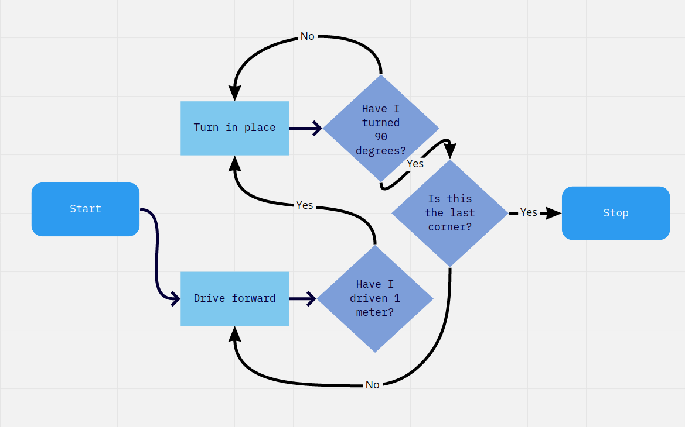
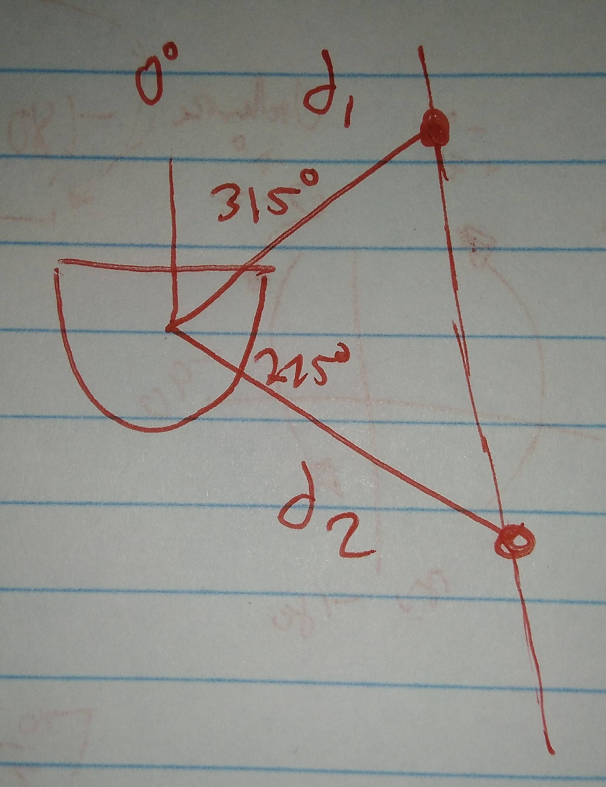
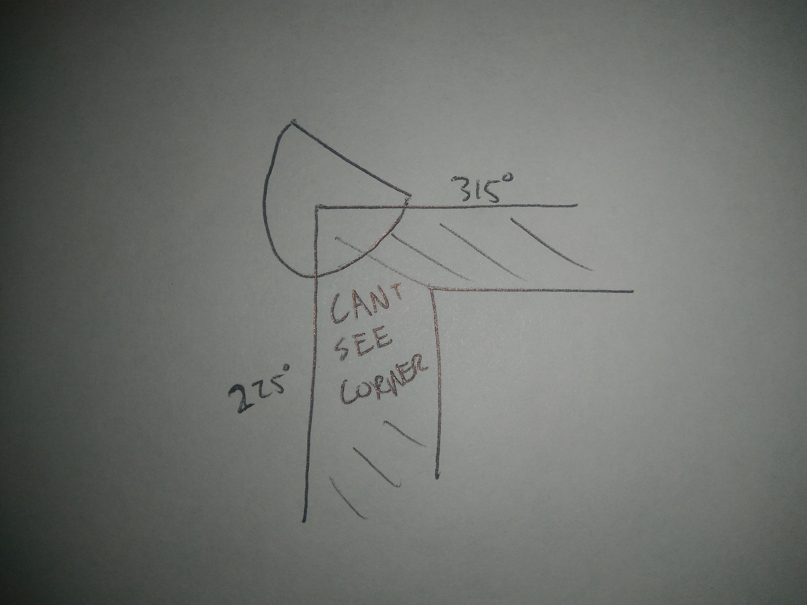
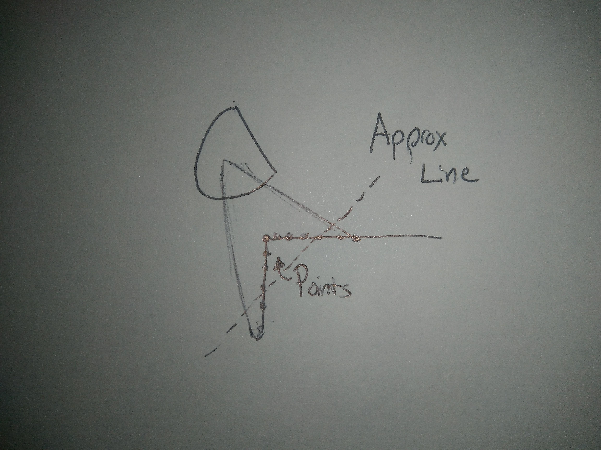
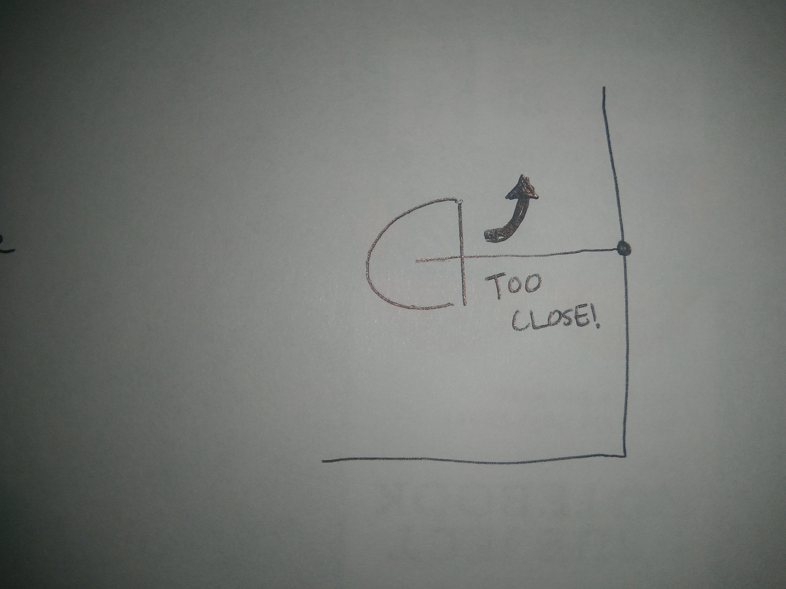
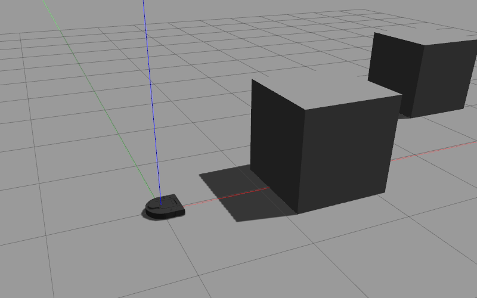
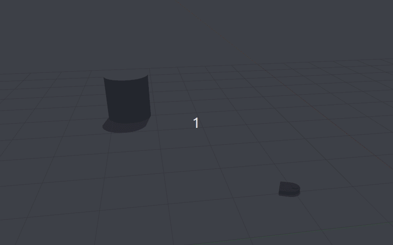

# CompRobo Warm-Up Project
This is my fork of the repo for the Olin Computational Robotics warmup project.
 
In `scripts`, you'll find all the scripts relevant to this project.
In `bags`, you'll find a `README.md` linking to a Google Drive Folder with the relevant ROS bags.
 
In this write-up, you'll find detailed explanations of each behavior that I implemented, as well as a brief overview of my software architecture, and a reflection on the project. The behaviors include teleop, driving in a square, wall following, human following, obstacle avoidance, and a fun bonus behavior.
 
## Robot Teleop
### Objective
Design a teleop mode for the Neato that allows a user to drive the Neato manually.
 
### W A S D Control
The code for this is contained in `scripts/custom_teleop.py`.
 
I decided to approach this problem like I was designing a control scheme for a video game Neato. The vast majority of modern computer games that require moving an object via a keyboard utilize the `W`, `A`, `S`, and `D` keys as though they were `Left`, `Down`, `Right`, and `Up` keys, respectively. My goal was to mimic this behaviour with the Neato.
 

 
###  Edge Cases and Limitations
 
You can see here what driving with this teleop mode looks like. I hoped to make the teleoperation of the Neato smoother and more intuitive than it is with ROS's built-in `teleop_twist_keyboard`. It's certainly far more intuitive to me as someone who is used to `W`, `A`, `S`, `D` control, so I was happy with the implementation.
 
The primary drawbacks revolve around how this controller is reading the keyboard input. The approach I took for keyboard input leaned heavily on the starter code provided by the professors. You can see how this is done in the `getKey()` method. The drawback of the `getKey()` method is that it has built-in debouncing. For example, if I hold down the `W` key while driving, the teleop only takes the first `W`, and waits a preset amount of time before accepting any more `W`s. While this feature is useful for inputs where a user wants to simply hit a key once and leave it be, it presents a problem for creating a smooth driving experience. I specifically designed this controller to ramp up the speed of the Neato according to how long a given key was pressed. For instance, if I held down `W`, I would expect the Neato to start moving forward, and then ramp up its speed as I continued to hold down `W`. With the built-in debouncing, when I try this, it feels like there's a lag between me holding a key down and the Neato actually speeding up accordingly.
 
If I spent more time on this section, I would find a different way to read keyboard inputs without built-in debouncing, and I would take into account timing when a key was held down. For instance, if I held down `W`, the Neato would speed up at a set rate, not just every time the controller read a `W`.
 
## Driving in a Square
### Objective
Drive on the edge of a 1 meter x 1 meter square.
 
### Proportional Distance and Angle Control
The code for this is contained in `scripts/drive_square.py`.
 
I decided to break this problem up into two categories: lines, and corners. At any given point along the edge of the square, the Neato will either be on a corner, where it has to turn to face the next line of the square, or on a line, where it has to drive until it hits a corner.
 
This makes it so that the Neato will normally be in one of two primary states, aptly named `line` and `corner`. The only exception is that once the Neato has completed the square, I want it to turn so that it faces the direction it faced when starting the square, and then stops moving. I formalized this into the following state machine.
 

 
When the Neato is driving in its `line` state, it needs to drive straight forward, and only stop once it has driven 1 meter, exactly. For precision, I decided to tackle this by creating a proportional controller that relies on the Neato's built-in odometry. The Neato records where it began the line, and drives forward until its distance from its starting point is ever-so-slightly greater than 1 meter. I formalize the controller here.
 
`linear_velocity` = `proportional_constant` (`1.0 m` - `distance_travelled`) + `0.001`
 
The primary drawback of using a proportional controller for tackling this problem was that I had to balance potentially overshooting the desired distance and moving too slowly towards the desired distance. I experimented with my proportional constant until I found a balance I was happy with. Since I leaned towards moving too slowly, the Neato technically only approaches its endpoint, but never actually makes it there. I worked around this by adding a constant `0.001 meters / second` to the velocity. This makes it so that once the Neato is practically at the point, the velocity gets an extra nudge that guarantees that the Neato converges on the point.
 
Once the Neato hits its intended distance of `1.0 m`, it switches state to `corner`, which I tackled similarly to the `line` state. The only difference was that I had to find a way to linearize the angle of the robot. I achieved this by breaking out the edge case where the robot crosses the `0 -> 360` threshold into a special case that takes into account the necessary logic to simplify the angle measurement to how far the Neato had turned since it began turning. This controller is formalized here.
 
`angular_velocity` = `proportional_constant` * (`90.0 degrees` - `angle_travelled`) + `0.01`
 
###  Edge Cases and Limitations
 
My code for this objective works quite well for its intended purpose. I spent some extra time generalizing this approach to work for any regular n-sided polygon, just out of curiosity. Unfortunately, I didn't follow the golden rule of software development: `Backup early, Backup often`, and lost the code when I reinstalled Ubuntu to fix some technical issues. If I spent more time beyond that, I would challenge myself by trying to make a controller that completed the square (or any regular n-sided polygon) as quickly, and precisely as possible. That would involve a mix of trying to model the Neato's dynamics quantitatively in order to achieve a strong approximation of constants I could plug into a PID controller for critical damping, and experimentally nudging the constants to see if I could improve accuracy, precision, and speed from there.
 
## Wall Following
### Objective
Detect and drive next to a wall.
 
### Iteration 0: Two-Point Perception
 
#### Overall Design
This iteration is found in `scripts/wallfollower_0.py`. Here is a helpful visual which helps to illustrate how the code works.
 

 
The `WallFollowerNode` grabs two distances from its scan, which we will call `d1` and `d2`, where one distance is at 315 degrees and the other is at 215, respectively. Conceptually, if these two distances are the same, and they accurately represent a wall next to the Neato, this is all the information needed to wall follow. The `WallFollowerNode` utilizes a simple proportional controller that multiplies a constant by the difference between the two distances to determine the angular velocity of the Neato. The linear velocity remains constant. We can see the function that determines the angular velocity expanded here:
 
`angular_velocity = proportional_constant * (d1 - d2)`
 
This simple approach was surprisingly robust against perturbations to the Neato, including both rotating the Neato towards or away from the wall, as well as moving the Neato closer or further away from the wall. So long as the `WallFollowerNode` could still "see" one of the points, the Neato could make its way back to the wall.
#### Performance
 

 
Even with just two points, we see that the `WallFollowerNode` can successfully drive the Neato alongside a straight wall, and even handle an outer corner. However, we see at the end that this approach is not very robust against sharp outer corners.
 
#### Edge Cases and Limitations
 
To handle the edge case where points on the wall were too far away to show up in the lidar scan, the `WallFollowerNode` assumed that any points it couldn't see where `1,000` meters away, which was likely why the Neato could still find its way back to the wall whenever one of the points was too far away. The massive distance made it so that the angular velocity controller would quickly correct the Neato if it was too far away. This approach also seemed to make the wall follower code slightly more robust at turning around outer corners, where the Neato would turn sharply, perceiving the corner as a wall where the front-most part was far away, and the back-most part was close. However, this was also where the simplicity of this controller began hitting its limits. The Neato could successfully make an outer turn, but because of the lack of information about the corner, the controller would wiggle the Neato chaotically through the turn. Part of the reason why is illustrated here.
 

 
The primary limitations of this controller revolve around its lack of information, and its lack of context. With this control scheme, the `WallFollowerNode` cannot recover the Neato from crashing straight into a wall, and the Neato cannot smoothly turn around corners. Additionally, since the points used were only on the right side of the Neato, the `WallFollowerNode` could only direct the Neato towards following a wall on its right.
 
This controller could be improved with the addition of more information from the lidar scan, making it so that the Neato can more robustly follow curvy walls that aren't well approximated by two points. This would also give the Neato more context around turning corners, and could make turning around outer corners smoother. The addition of information about what is directly in front of the Neato through the points in the front of the lidar scan would make it possible for the Neato to even handle inner corners without crashing. Further, the proportional controller itself could be upgraded to PID for smoother course corrections in general.
 
<!-- I originally intended to iterate further on this wall follower control scheme, but due to various technical difficulties and time constraints, I'll more likely direct that energy to remaining parts of this project. -->
 
### Iteration 1: Averaging Several Points
This iteration is found in `scripts/wallfollower_1.py`. Here is a helpful visual which helps to illustrate how the code works.
 
<!--  -->

 
The `WallFollowerNode` grabs a sub selection of points to the right of the Neato from its scan, which it stores in what we will call vector `P`. The number of points, the center of the subselection, and the range of the subselection can all be easily modified in software. Any points in the specified range that were too far for the lidar to measure are not included in the subselection.
 
This makes it so that the `WallFollowerNode` now has a lot more information about what's next to the Neato, and can more accurately direct the Neato around corners, which are now approximated as lines. Instead of taking differences between points, this design approximates a line from the sub selected points, finds the slope, and uses that to proportionally control the Neato's heading. We can represent this as follows:
 
`angular_velocity = proportional_constant * (average(P_x) / average(P_y))`
 
where:
 
`V_x` is the x position of sub selected points
 
`V_y` is the corresponding y position of sub selected points
 
This approach improved the overall robustness of the `WallFollowerNode`, allowing it to better navigate corners.
 
#### Performance
 

 
We see the same level of robustness when the Neato is following a straight wall, and far more robustness against outer corners. The `WallFollowerNode` successfully drives the Neato around a sharp turn. However, the `WallFollowerNode` does not take into account the rest of the Neato's surroundings, as demonstrated by the crash at the end.
 
#### Edge Cases and Limitations
 
This control scheme simply does not take into account enough information about the Neato's surroundings to be able to successfully navigate inside corners. This controller could also face challenges attempting to navigate a wall with lots of large bumps or corners. While the `WallFollowerNode` for the most part abstracts any wall into a line, and could easily thus navigate any curvy or bumpy walls as though they were straight, all of the parameters involved in creating that abstraction are user-defined. I've included an example drawing to illustrate how the parameters used to subselect points for line approximation could largely impact the Neato's behavior.
 
### Iteration 2: Don't Crash
This iteration is found in `scripts/wallfollower_2.py`. Here is a helpful visual which helps to illustrate how the code works.
 

 
The `WallFollowerNode` behaves almost exactly as it does for Iteration 1. The key difference is that now, the wall follower switches between two states, "wall following" and "turning left". In addition to sub selecting points for line approximation, the `WallFollowerNode` also checks the front-most point in the lidar scan to determine whether or not the Neato is about to crash into a wall. If the front-most point's distance drops below a certain threshold, the `WallFollerNode` takes evasive action and switches from its "wall following" state to its ``turning left" state. Once the front-most point is far enough away so that its distance goes above the threshold, the `WallFollowerNode` automatically switches back to "wall following".
 
#### Performance
 

 
This iteration completely outperforms the previous iterations. The `WallFollowerNode` successfully directs the Neato around both inner and outer corners. It even performed robustly enough to outline a whole letter!
 
#### Edge Cases and Limitations
I've mostly been testing these iterations in closed environments where I have complete control over what objects will be around the Neato at any given time. Were I testing these iterations in an open environment, the Neato could behave in unexpected ways. No consideration has been given to moving obstacles, smaller objects below the Neato's lidar blocking the Neato, or a host of other challenges that the Neato might encounter in the real world.
 
The smoothness of this controller is limited by the fact that it's proportional, so the controller cannot be critically damped. This is further made difficult by the fact that the Neato has a wide range of possible turn angles, where sometimes it has to only slightly adjust its heading and other times it has to make a sharp turn around a corner. The proportional controller is a compromise between enabling the Neato to make sharp enough turns to not miss corners and not overcorrecting when the heading needs only a slight adjustment. A much smoother controller would utilize PID control or another creative, non-linear method.
 
## Person Following
### Objective
Detect and follow a person.

### Overall Design
The code for this is in `scripts/human_follow.py`.

I designed a simple algorithm that uses the "center of mass" technique to find a person in front of the Neato. The algorithm subselects the points from the lidar scan that come from the front of the Neato, between 30 and -30 degrees, averages out the positions of the points, and determines that average to be the center of the person.

The Neato uses a proportional controller to turn towards the center of the person, and another proprtional controller to drive towards the person until the Neato is half a meter away from the person. We can see this formalized here:

`angular_velocity = proportional_constant * (average(P_x) / average(P_y))`

`linear_velocity = proportional_constant * (distance_to_human - 0.5)`

where;

`P_x` is all of the x components of the subselected points

`P_y` is all of the y components of the subselected points

If the Neato ever loses sight of the person, it spins in place in the direction it last saw the person until it sees them again. Unfortunately, this means that if the person goes beyond a certain range, the Neato simply spins in place forever.

### Performance


Since I didn't have a strong enough wifi connection during development, I couldn't actually load in a person-like object into gazebo for testing, so this would really be more aptly named, "sphere follower". Luckily I found that the sphere was the perfect test for this in gazebo since it tends to roll away as soon as any force acts on it. That makes it perfect for ensuring that the Neato can actually follow a moving object.

We can see that the Neato performs well in staying aligned with the sphere, and being sure not to crash into it unless I've purposely placed the sphere directly on the Neato. We can also see that the Neato successfully drives up to the sphere, and follows it an appropriate distance, speeding up whenever the sphere begins to roll too far away.

### Edge Cases and Limitations

This is a highly limited implementation of a human follower, and has several limitations. I think it's most glaring flaw is that it has no way of knowing what it's actually looking at. It just assumes that any points within a 60 degree field of view must be a human, and that it must follow that. This means that the Neato can be easily fooled into following just about any object, like the sphere I used for testing, instead of exclusively following humans. This assumption also means that the Neato can't distinguish between several objects in its field of view. If I placed two spheres right in front of the Neato, it would likely average them out, and drive right between them. I think the best remedy to this would be to create an additional layer of data processing that specifically looks for two circular clusters representing legs, finds the center between them, and feeds that into the controllers for human following.

## Obstacle Avoidance
### Objective
Drive forward and reactively avoid obstacles.

### Overall Design
The code for this is in `scripts/basic_obstacle_avoid.py`.

I decided to implement what I anticpiated to be a simple obstacle avoidance algorithm where the Neato would simply turn 90 degrees when it saw an obstacle until it was clear of the obstacle to proceed on its original path. I quickly learned that I had somehow managed to get to this point in the project without having a clear understanding of the reference frames I had used for the previous behaviours, since I had mostly relied on what the Neato saw directly from its lidar. This made an otherwise quite simple behavior quite complicated, as I quickly saw all of my previous assumptions fly out the window. To make matters worse, I wanted to use states from previous beahviors, namely the turning from `drive_square.py`, and I realized that I hadn't created a nice software architecture that actually made my code modular.

### Performance



Despite those challenges, I did manage to create a basic obstacle avoidance algorithm. The Neato drives until any point in front of it, and between the sides of the Neato, is closer than half a meter. At that point, the Neato stops, turns left until it hits 90 degrees, and begins driving forward. The Neato keeps driving until the closest point from the obstacle is further than half a meter away. Finally, the Neato turns right by 90 degrees and proceeds on its original path until it sees another obstacle.

### Edge Cases and Limitations

This implementation is absolutely riddled with limitations. The biggest one is likely the fact that the Neato will always turn 90 degrees, and always drive until it's half a meter away from any points. This leaves absolutely no space for slanted walls, curved objects, moving objects, corners, and a mulitude of other features that could appear in a less fabricated setting. If I were going to make a tweak to make this algorithm better, I would put the Neato into wall follow mode when it encounters an obstacle, until it gets clear of the obstacle, at which point it can stop wall following the obstacle, and simply go back to it's original objective.

## Bonus Behavior: Tackle
### Objective
Combine two or more earlier behaviors into a finite state-controller OR implement a new behavior using finite state control.

My chosen objective is: Create a new behavior in which the Neato slowly sneaks up on an object before tackling it like a cheetah.

### Overall Design

The code for this is in `scripts/tackle.py`

The design for this quite similar to the human follower I created earlier, but in my opinion, a bit more fun. It utilizes three states:

1. Search

2. Sneak and Tackle

3. Victory

First, the Neato spins around looking for any object within a 60 degree field of view. When the Neato spots an object (or really any points within its field of view), the Neato begins slowly sneaking towards the center of that object. The controller determining the Neato's linear velocity is specifically designed to move the Neato slowly when it's far away from its target, and very quickly as soon as the Neato gets within a certain range. If the Neato successfully tackles the object, its bump sensor should be triggered, at which point, the Neato has decided that it's victorious and stops moving, unless of course, the object starts moving again.

### Performance



We can see here quite clearly how much more fun this is than human following.

### Edge Cases and Limitations

One edge case is quite evident in the performance gif. One of the problems with driving Neatos at super high speeds (specifically in simulation) is that they become highly unstable. What's actually happening in the gif when the Neato zips away is that the Neato is rocking back and forth at a ridiculously high speed. This makes it so that the lidar is constantly reading in that there's something directly in front of the Neato, when in reality, it's just constantly catching a glimpse of the floor. This could be improved by having the Neato take into account its own pitch when processing its point data.

Also, with this behavior, I could place a brick wall in front of the Neato and it would literally fly towards it at full speed. This is not very intelligent tackling code.

## Software Architecture
I decided to make each behavior self contained in its own Python script as its own node for this project. Each behavior is an object in Python, and a node in ROS. I experimented with different ways of switching states, at first using an attribute that stored a string with the name of the appropriate state that was checked in the main loop so that the appropriate actions could be taken by the Neato. Then, I upped my game and made the state attribute store a function that _was_ the code for that state. Since Python is dynamically typed, and everything is an object, I was able to set up something like so:

```
while not rospy.is_shutdown():
    if self.updateUserInput() == "SHUTDOWN":
        break
    elif self.isRunning():
        self.state = self.state()
    else:
        self.pub.publish(Twist())
    r.sleep()
```

The important take-away from this chunk of code is the `self.state = self.state()`. My state might be a method called `followRightWallState()`, and when this code runs, `state()` will alias to `followRightWallState()`, and the code for that method will be executed. At the end of the function, I could either switch states by returning a different state method, or keep the same state by having the state return its own method. This was nice for the simple state machines, but whenever I had more than two states, this quickly became a hassle. I think it would have been better for me to have leveraged ROS nodes and an arbiter for this, and have the arbiter deicde when to switch states instead of making each individual state responsible for knowing when to switch states.

You'll also notice that there's a `self.updateUserInput()` method that's being called. Early on in the project, I decided that I wanted to be able to give my ROS nodes keyboard commands while they were running. My baseline intention was so that a node would only start moving the Neato when I hit enter, and always ESTOP when I hit space. What I really hoped for, though, was parameter tunning through keyboard input while the node was running. That never came to fruition, though, likely because it wasn't particularly useful for these behaviors and because it wasn't at the forefront of my mind the whole time.

If you go through the individual scripts for each of these behaviors, you'll notice that the code becomes cleaner and more organized up until the third wall follower. At this point, maintaining clean code became more hassle than it was worth, and every node is called `WallFollower`. I'm considering either creating some kind of ROS boilerplate code for myself to make creating new ROS nodes more painless, and potentially even automating the part where I would manually have to go through and change all of the variable names that correspond to the name of the node.

## Final Reflection

I made a lot of mistakes on this project. I think my biggest one was not taking my time to visualize and correct all the assumptions I was making about the different reference frames I was using along the way. I jumped right into programming behaviors without taking the time to make sure that what I thought would be a positive x would in fact be positive, and that angles were aligned how I thought they were. In future projects, I'm going to focus more on that part early on.