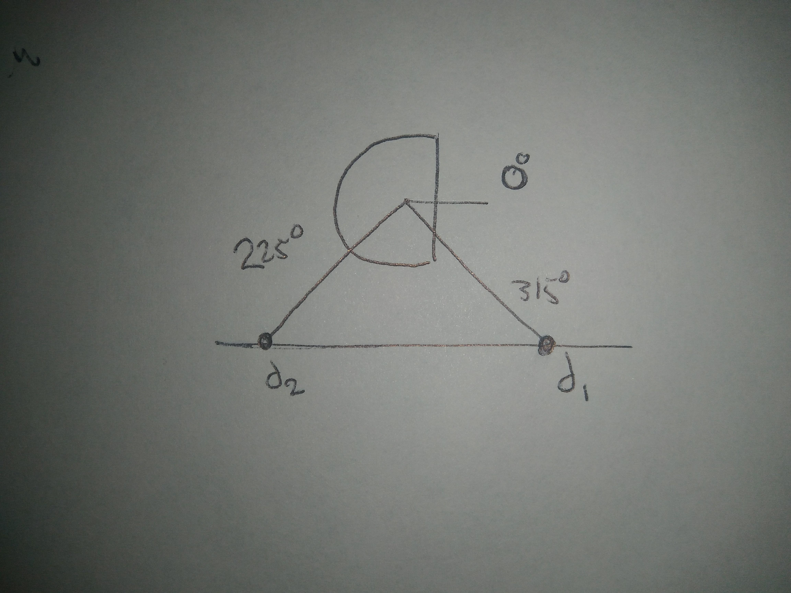

# CompRobo Warm-Up Project
This is the base repo for the Olin Computational Robotics warmup project.

In `scripts`, you'll find all the scripts relavent to this project.
In `bags`, you'll find a `README.md` linking to a Google Drive Folder with the relavent ROS bags.

## Preliminary Wall Follower Write Up

My wall follower code is found in `scripts/wallfollower.py`. Here is a helpful visual which helps to illustrate how the code works.

The `WallFollowerNode` grabs two distances from its scan, which we will call `d1` and `d2`, where one distance is at 315 degrees and the other is at 215, respectively. Conceptually, if these two distances are the same, and they accurately represent a wall next to the Neato, this is all the information needed to wall follow. The `WallFollowerNode` utilizes a simple proportional controller that multiplies a constant by the difference between the two distances to determine the angular velocity of the Neato. The linear velocity remains constant. We can see the function that determines the angular velocity expanded here:

`angular_velocity = proportional_constant * (d1 - d2)`

This simple approach was surprisingly robust against perturbations to the Neato, including both rotating the Neato towards or away from the wall, as well as moving the Neato closer or further away from the wall. So long as the `WallFollowerNode` could still "see" one of the points, the Neato could make its way back to the wall.

To handle the edge case where points on the wall were too far away to show up in the lidar scan, the `WallFollowerNode` assumed that any points it couldn't see where `1,000` meters away, which was likely why the Neato could still find its way back to the wall whenever one of the points was too far away. The massive distance made it so that the angular velocity controller would quickly correct the Neato if it was too far away. This approach also seemed to make the wall follower code slighly more robust at turning around outer corners, where the Neato would turn sharply, perceiving the corner as a wall where the front-most part was far away, and the back-most part was close. However, this was also where the simplicity of this controller began hitting its limits. The Neato could successfully make an outer turn, but because of the lack of information about the corner, the controller would wiggle the Neato choatically through the turn. Part of the reason why is illustrated here.

The primary limitations of this controller revolve around its lack of information, and its lack of context. With this control scheme, the `WallFollowerNode` cannot recover the Neato from crashing straight into a wall, and the Neato cannot smoothly turn around corners. Additionally, since the points used where only on the right side of the Neato, the `WallFollowerNode` could only direct the Neato towards following a wall on its right.

This controller could be improved with the addition of more information from the lidar scan, making it so that the Neato can more robustly follow curvy walls that aren't well approximated by two points. This would also give the Neato more context around turning corners, and could make turning around outer corners smoother. The addition of information about what is directly in front of the Neato through the points in the front of the lidar scan would make it possible for the Neato to even handle inner corners without crashing. Further, the proportional controller itself could be upgraded to PID for smoother course corrections in general.

I originally intended to iterate further on this wall follower control scheme, but due to various technical difficulties and time constraints, I'll more likely direct that energy to remaining parts of this project.