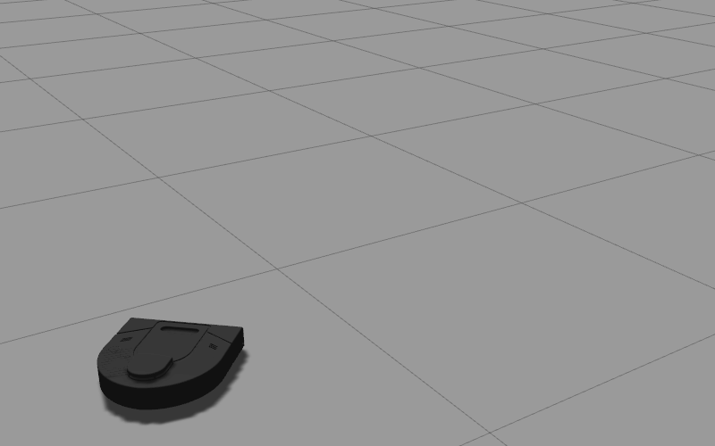

# CompRobo Warm-Up Project
This is my fork of the repo for the Olin Computational Robotics warmup project.
 
In `scripts`, you'll find all the scripts relevant to this project.
In `bags`, you'll find a `README.md` linking to a Google Drive Folder with the relevant ROS bags.
 
In this write-up, you'll find detailed explanations of each behavior that I implemented.
 
## Robot Teleop
### Objective
Design a teleop mode for the Neato that allows a user to drive the Neato manually.
 
### W A S D Control
The code for this is contained in `scripts/custom_teleop.py`.
 
I decided to approach this problem like I was designing a control scheme for a video game Neato. The vast majority of modern computer games that require moving an object via a keyboard utilize the `W`, `A`, `S`, and `D` keys as though they were `Left`, `Down`, `Right`, and `Up` keys, respectively. My goal was to mimic this behaviour with the Neato.
 

 
### If I had more time...
 
You can see here what driving with this teleop mode looks like. I hoped to make the teleoperation of the Neato smoother and more intuitive than it is with ROS's built-in `teleop_twist_keyboard`. It's certainly far more intuitive to me as someone who is used to `W`, `A`, `S`, `D` control, so I was happy with the implementation.
 
The primary drawbacks revolve around how this controller is reading the keyboard input. The approach I took for keyboard input leaned heavily on the starter code provided by the professors. You can see how this is done in the `getKey()` method. The drawback of the `getKey()` method is that it has built-in debouncing. For example, if I hold down the `W` key while driving, the teleop only takes the first `W`, and waits a preset amount of time before accepting any more `W`s. While this feature is useful for inputs where a user wants to simply hit a key once and leave it be, it presents a problem for creating a smooth driving experience. I specifically designed this controller to ramp up the speed of the Neato according to how long a given key was pressed. For instance, if I held down `W`, I would expect the Neato to start moving forward, and then ramp up its speed as I continued to hold down `W`. With the built-in debouncing, when I try this, it feels like there's a lag between me holding a key down and the Neato actually speeding up accordingly.
 
If I spent more time on this section, I would find a different way to read keyboard inputs without built-in debouncing, and I would take into account timing when a key was held down. For instance, if I held down `W`, the Neato would speed up at a set rate, not just every time the controller read a `W`.
 
## Driving in a Square
### Objective
Drive on the edge of a 1 meter x 1 meter square.
 
### Proportional Distance and Angle Control
The code for this is contained in `scripts/drive_square.py`.
 
I decided to break this problem up into two categories: lines, and corners. At any given point along the edge of the square, the Neato will either be on a corner, where it has to turn to face the next line of the square, or on a line, where it has to drive until it hits a corner.
 
This makes it so that the Neato will normally be in one of two primary states, aptly named `line` and `corner`. The only exception is that once the Neato has completed the square, I want it to turn so that it faces the direction it faced when starting the square, and then stops moving. I formalized this into the following state machine.
 

 
When the Neato is driving in its `line` state, it needs to drive straight forward, and only stop once it has driven 1 meter, exactly. For precision, I decided to tackle this by creating a proportional controller that relies on the Neato's built-in odometry. The Neato records where it began the line, and drives forward until its distance from its starting point is ever-so-slightly greater than 1 meter. I formalize the controller here.
 
`linear_velocity` = `proportional_constant` (`1.0 m` - `distance_travelled`) + `0.001`
 
The primary drawback of using a proportional controller for tackling this problem was that I had to balance potentially overshooting the desired distance and moving too slowly towards the desired distance. I experimented with my proportional constant until I found a balance I was happy with. Since I leaned towards moving too slowly, the Neato technically only approaches its endpoint, but never actually makes it there. I worked around this by adding a constant `0.001 meters / second` to the velocity. This makes it so that once the Neato is practically at the point, the velocity gets an extra nudge that guarantees that the Neato converges on the point.
 
Once the Neato hits its intended distance of `1.0 m`, it switches state to `corner`, which I tackled similarly to the `line` state. The only difference was that I had to find a way to linearize the angle of the robot. I achieved this by breaking out the edge case where the robot crosses the `0 -> 360` threshold into a special case that takes into account the necessary logic to simplify the angle measurement to how far the Neato had turned since it began turning. This controller is formalized here.
 
`angular_velocity` = `proportional_constant` * (`90.0 degrees` - `angle_travelled`) + `0.01`
 
### If I had more time...
 
My code for this objective works quite well for its intended purpose. I spent some extra time generalizing this approach to work for any regular n-sided polygon, just out of curiosity. Unfortunately, I didn't follow the golden rule of software development: `Backup early, Backup often`, and lost the code when I reinstalled Ubuntu to fix some technical issues. If I spent more time beyond that, I would challenge myself by trying to make a controller that completed the square (or any regular n-sided polygon) as quickly, and precisely as possible. That would involve a mix of trying to model the Neato's dynamics quantitatively in order to achieve a strong approximation of constants I could plug into a PID controller for critical damping, and experimentally nudging the constants to see if I could improve accuracy, precision, and speed from there.
 
## Wall Following
### Objective
Detect and drive next to a wall.
 
### Iteration 0: Two-Point Perception
 
#### Overall Design
This iteration is found in `scripts/wallfollower_0.py`. Here is a helpful visual which helps to illustrate how the code works.
 

 
The `WallFollowerNode` grabs two distances from its scan, which we will call `d1` and `d2`, where one distance is at 315 degrees and the other is at 215, respectively. Conceptually, if these two distances are the same, and they accurately represent a wall next to the Neato, this is all the information needed to wall follow. The `WallFollowerNode` utilizes a simple proportional controller that multiplies a constant by the difference between the two distances to determine the angular velocity of the Neato. The linear velocity remains constant. We can see the function that determines the angular velocity expanded here:
 
`angular_velocity = proportional_constant * (d1 - d2)`
 
This simple approach was surprisingly robust against perturbations to the Neato, including both rotating the Neato towards or away from the wall, as well as moving the Neato closer or further away from the wall. So long as the `WallFollowerNode` could still "see" one of the points, the Neato could make its way back to the wall.
#### Performance
 

 
Even with just two points, we see that the `WallFollowerNode` can successfully drive the Neato alongside a straight wall, and even handle an outer corner. However, we see at the end that this approach is not very robust against sharp outer corners.
 
#### Edge Cases and Limitations
 
To handle the edge case where points on the wall were too far away to show up in the lidar scan, the `WallFollowerNode` assumed that any points it couldn't see where `1,000` meters away, which was likely why the Neato could still find its way back to the wall whenever one of the points was too far away. The massive distance made it so that the angular velocity controller would quickly correct the Neato if it was too far away. This approach also seemed to make the wall follower code slightly more robust at turning around outer corners, where the Neato would turn sharply, perceiving the corner as a wall where the front-most part was far away, and the back-most part was close. However, this was also where the simplicity of this controller began hitting its limits. The Neato could successfully make an outer turn, but because of the lack of information about the corner, the controller would wiggle the Neato chaotically through the turn. Part of the reason why is illustrated here.
 

 
The primary limitations of this controller revolve around its lack of information, and its lack of context. With this control scheme, the `WallFollowerNode` cannot recover the Neato from crashing straight into a wall, and the Neato cannot smoothly turn around corners. Additionally, since the points used were only on the right side of the Neato, the `WallFollowerNode` could only direct the Neato towards following a wall on its right.
 
This controller could be improved with the addition of more information from the lidar scan, making it so that the Neato can more robustly follow curvy walls that aren't well approximated by two points. This would also give the Neato more context around turning corners, and could make turning around outer corners smoother. The addition of information about what is directly in front of the Neato through the points in the front of the lidar scan would make it possible for the Neato to even handle inner corners without crashing. Further, the proportional controller itself could be upgraded to PID for smoother course corrections in general.
 
<!-- I originally intended to iterate further on this wall follower control scheme, but due to various technical difficulties and time constraints, I'll more likely direct that energy to remaining parts of this project. -->
 
### Iteration 1: Averaging Several Points
This iteration is found in `scripts/wallfollower_1.py`. Here is a helpful visual which helps to illustrate how the code works.
 
<!--  -->

 
The `WallFollowerNode` grabs a sub selection of points to the right of the Neato from its scan, which it stores in what we will call vector `P`. The number of points, the center of the subselection, and the range of the subselection can all be easily modified in software. Any points in the specified range that were too far for the lidar to measure are not included in the subselection.
 
This makes it so that the `WallFollowerNode` now has a lot more information about what's next to the Neato, and can more accurately direct the Neato around corners, which are now approximated as lines. Instead of taking differences between points, this design approximates a line from the sub selected points, finds the slope, and uses that to proportionally control the Neato's heading. We can represent this as follows:
 
`angular_velocity = proportional_constant * (average(P_x) / average(P_y))`
 
where:
 
`V_x` is the x position of sub selected points
 
`V_y` is the corresponding y position of sub selected points
 
This approach improved the overall robustness of the `WallFollowerNode`, allowing it to better navigate corners.
 
#### Performance
 

 
We see the same level of robustness when the Neato is following a straight wall, and far more robustness against outer corners. The `WallFollowerNode` successfully drives the Neato around a sharp turn. However, the `WallFollowerNode` does not take into account the rest of the Neato's surroundings, as demonstrated by the crash at the end.
 
#### Edge Cases and Limitations
 
This control scheme simply does not take into account enough information about the Neato's surroundings to be able to successfully navigate inside corners. This controller could also face challenges attempting to navigate a wall with lots of large bumps or corners. While the `WallFollowerNode` for the most part abstracts any wall into a line, and could easily thus navigate any curvy or bumpy walls as though they were straight, all of the parameters involved in creating that abstraction are user-defined. I've included an example drawing to illustrate how the parameters used to subselect points for line approximation could largely impact the Neato's behavior.
 
### Iteration 2: Don't Crash
This iteration is found in `scripts/wallfollower_2.py`. Here is a helpful visual which helps to illustrate how the code works.
 

 
The `WallFollowerNode` behaves almost exactly as it does for Iteration 1. The key difference is that now, the wall follower switches between two states, "wall following" and "turning left". In addition to sub selecting points for line approximation, the `WallFollowerNode` also checks the front-most point in the lidar scan to determine whether or not the Neato is about to crash into a wall. If the front-most point's distance drops below a certain threshold, the `WallFollerNode` takes evasive action and switches from its "wall following" state to its ``turning left" state. Once the front-most point is far enough away so that its distance goes above the threshold, the `WallFollowerNode` automatically switches back to "wall following".
 
#### Performance
 

 
This iteration completely outperforms the previous iterations. The `WallFollowerNode` successfully directs the Neato around both inner and outer corners. It even performed robustly enough to outline a whole letter!
 
#### Edge Cases and Limitations
I've mostly been testing these iterations in closed environments where I have complete control over what objects will be around the Neato at any given time. Were I testing these iterations in an open environment, the Neato could behave in unexpected ways. No consideration has been given to moving obstacles, smaller objects below the Neato's lidar blocking the Neato, or a host of other challenges that the Neato might encounter in the real world.
 
The smoothness of this controller is limited by the fact that it's proportional, so the controller cannot be critically damped. This is further made difficult by the fact that the Neato has a wide range of possible turn angles, where sometimes it has to only slightly adjust its heading and other times it has to make a sharp turn around a corner. The proportional controller is a compromise between enabling the Neato to make sharp enough turns to not miss corners and not overcorrecting when the heading needs only a slight adjustment. A much smoother controller would utilize PID control or another creative, non-linear method.
 
 
 

